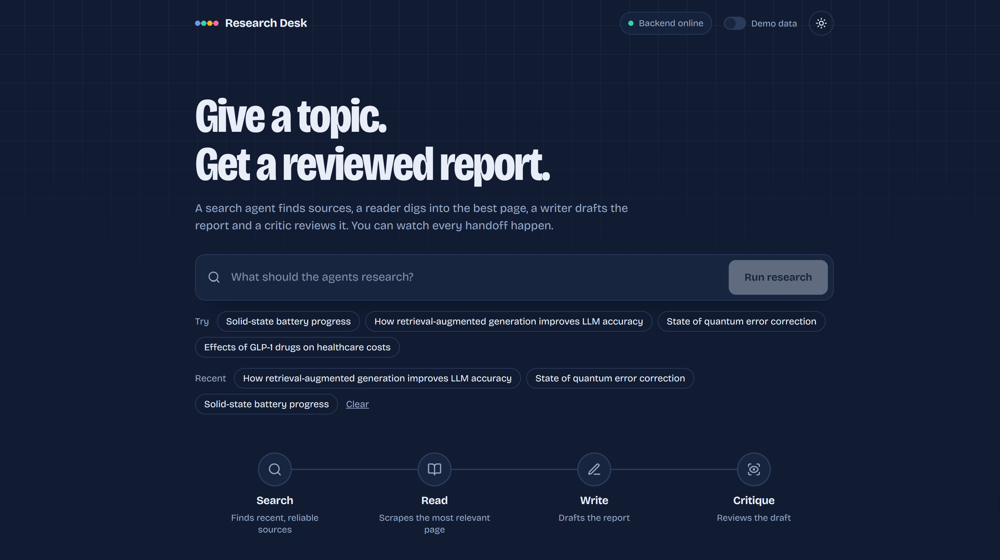
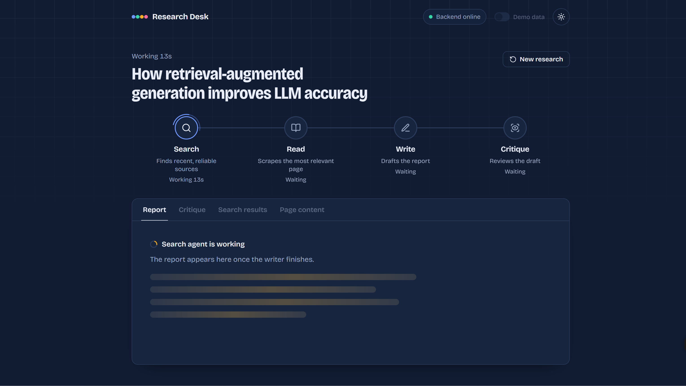

# Research Desk

Research Desk is a small multi-agent research app that turns a topic into a reviewed report.

You enter a topic, and the agents work through four steps:

**Search → Read → Write → Critique**

The frontend shows the progress while the backend runs the research pipeline.

### Live Demo

**https://research-agent-system.vercel.app/**

## What it does

- Searches the web for relevant information
- Reads a selected source in more detail
- Generates a research report
- Reviews the generated report with a critic agent
- Shows the progress of each step in the UI
- Streams backend progress to the frontend using SSE

## Screenshots

### Home



### Live research progress



## How it works

```text
User
  ↓
React + Vite (Vercel)
  ↓
FastAPI (Render)
  ↓
Search Agent
  ↓
Reader Agent
  ↓
Writer
  ↓
Critic
  ↓
Reviewed Report
```

The frontend and backend are deployed separately. The React app on Vercel calls the FastAPI backend on Render, and the backend streams the agent status back to the UI.

## Tech Stack

- React + Vite
- Python
- FastAPI
- LangChain
- OpenAI
- Google Gemini
- Tavily
- BeautifulSoup
- Server-Sent Events (SSE)
- Vercel
- Render

## Run locally

### Backend

From the project folder:

```bash
pip install -r requirements.txt
uvicorn server:app --reload --port 8000
```

### Frontend

```bash
cd frontend
npm install
npm run dev
```

Then open:

```text
http://localhost:5173
```

For local development, set the frontend API URL to:

```env
VITE_API_URL=http://localhost:8000
```

## Project structure

```text
multi_agent_system/
├── agent.py
├── pipeline.py
├── tools.py
├── server.py
├── requirements.txt
│
└── frontend/
    ├── src/
    ├── package.json
    ├── vite.config.js
    └── index.html
```

## Deployment

- **Frontend:** Vercel
- **Backend:** Render
- **Source code:** GitHub

The Vercel frontend uses `VITE_API_URL` to connect to the Render backend.

## Environment variables

Backend:

```env
OPENAI_API_KEY=your_key
TAVILY_API_KEY=your_key
GOOGLE_API_KEY=your_key
ALLOWED_ORIGINS=https://research-agent-system.vercel.app
```

Frontend:

```env
VITE_API_URL=https://your-backend.onrender.com
```

Keep API keys in environment variables and do not commit your `.env` file.

---

Made as a practical project to explore multi-agent workflows, web research, and real-time AI application interfaces.
